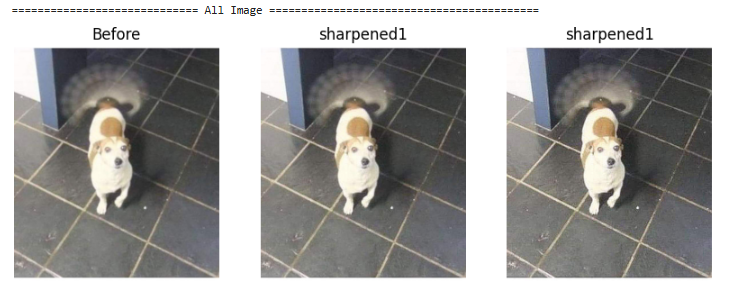
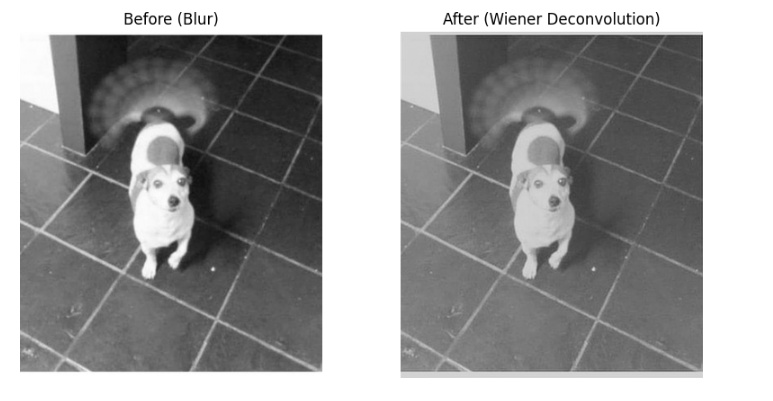
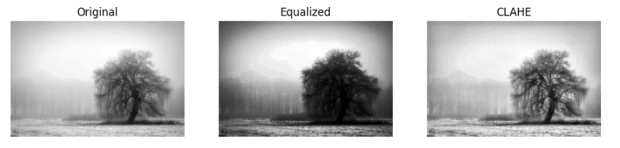
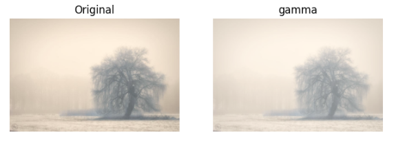
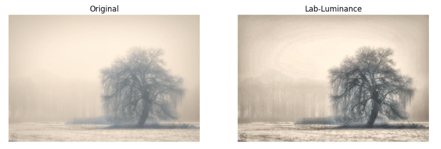
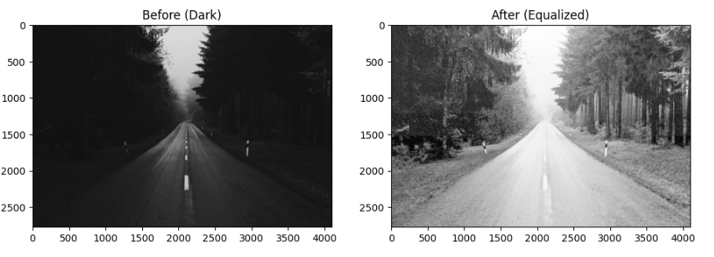
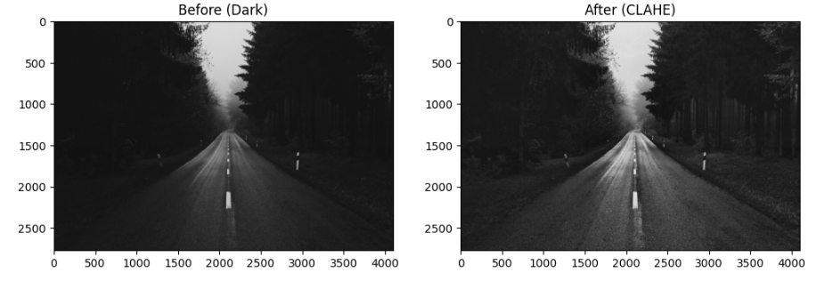
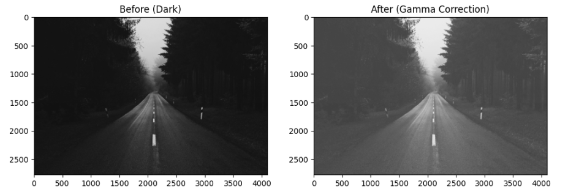

# 🖼️ Image Enhancement Documentation

Proyek ini berisi implementasi beberapa metode untuk meningkatkan kualitas citra yang mengalami masalah umum seperti **blur**, **low contrast (white washed / terlalu terang)**, maupun **low contrast (dark / terlalu gelap)**.  

---

## 🔹 1. Image Blur
Citra blur dapat terjadi akibat gerakan kamera, ketidakfokusan, atau kualitas lensa. Dua pendekatan yang digunakan adalah:

### a. Sharpening Filter
Bekerja dengan cara melakukan konvolusi menggunakan kernel khusus yang menekankan perbedaan intensitas antar piksel.  
Dalam eksperimen ini digunakan **dua jenis kernel**:

#### 🔸 Sharpening 1
```text
[[0, -1, 0],
 [-1, 5, -1],
 [0, -1, 0]]
```
Kernel ini bekerja dengan menambahkan bobot lebih besar pada piksel tengah (5) dan mengurangi nilai tetangganya (-1).
Efeknya menghasilkan peningkatan ketajaman yang lebih halus sehingga cocok untuk blur ringan.

#### 🔸 Sharpening 2
```text
[[-1, -1, -1],
 [-1,  9, -1],
 [-1, -1, -1]]
```
Kernel ini memberikan bobot jauh lebih besar pada piksel tengah (9) dan penekanan lebih kuat pada tetangganya (-1).
Efeknya menghasilkan citra yang lebih tajam dan kontras tinggi, tetapi bisa menimbulkan noise lebih jelas dibanding kernel pertama.



### b. Wiener Deconvolution
Wiener filtering digunakan untuk mengembalikan citra yang blur dengan mempertimbangkan fungsi penyebaran titik (PSF).

PSF yang digunakan:
```python
psf = np.ones((5, 5)) / 25
```
PSF (Point Spread Function) ini adalah kernel berukuran 5×5 dengan semua elemen bernilai sama. PSF ini merepresentasikan blur rata-rata (uniform blur), seperti efek ketika gambar menjadi buram karena pergerakan kecil atau defocus. Dengan PSF ini, Wiener filter mencoba membalikkan efek blur tersebut agar citra lebih tajam kembali.



---

## 🔹 2. Low Contrast White
Citra dengan kontras rendah pada area terang biasanya tampak pucat (*washed out*). Metode yang digunakan:

### a. Histogram Equalization
Menyebarkan distribusi intensitas piksel agar lebih merata sehingga citra memiliki kontras yang lebih baik secara global.



### b. Gamma Correction
Mengubah distribusi kecerahan berdasarkan fungsi gamma. Dengan nilai gamma tertentu, citra yang terlalu terang dapat diseimbangkan pencahayaannya.



### c. LAB Enhance Luminance
Mengubah citra ke ruang warna LAB, lalu melakukan perbaikan hanya pada channel **L (Luminance)** untuk meningkatkan kontras tanpa memengaruhi warna asli.



---

## 🔹 3. Low Contrast Dark
Citra dengan kontras rendah pada area gelap biasanya tampak redup dan detail hilang. Metode yang digunakan:

### a. Histogram Equalization
Meratakan distribusi intensitas piksel sehingga area gelap menjadi lebih terang dan detail lebih terlihat.



### b. CLAHE (Contrast Limited Adaptive Histogram Equalization)
Versi adaptif dari histogram equalization yang bekerja pada blok-blok kecil citra. CLAHE mencegah peningkatan kontras yang berlebihan dan menjaga detail lokal.



### c. Gamma Correction
Mengatur kecerahan citra menggunakan fungsi gamma. Nilai gamma < 1 digunakan untuk mencerahkan citra gelap sehingga detail lebih jelas.



---

